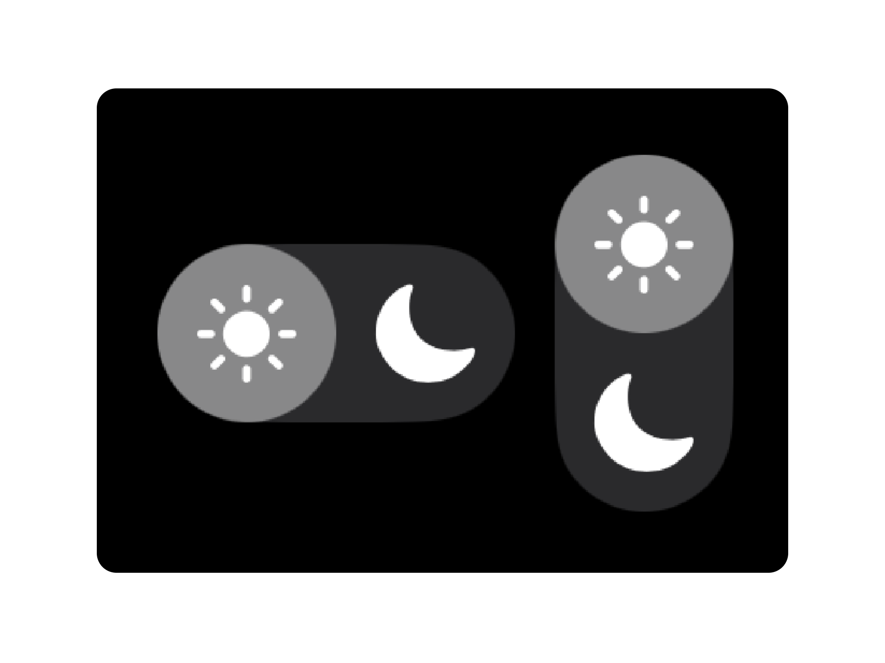

#  SlidingToggleButton

A minimal sliding toggle button SwiftUI Swift Package library.



## Installation

You can add SlidingToggleButton to your project via Swift Package Manager:
1. Open your project in Xcode.
2. Navigate to File > Add Package Dependencies.
3. Enter the following URL:

```
https://github.com/TahaTesser/SlidingToggleButton.git
```

## Example Usage

```swift
struct ContentView: View {
    @State private var isDarkMode = false

    var body: some View {
        HStack {
            // Horizontal Sliding Toggle Button
            SlidingToggleButton(
                isToggled: $isDarkMode,
                size: 20,
                startIconName: "sun.max.fill",
                endIconName: "moon.fill"
            )
            // Vertical Sliding Toggle Button
            SlidingToggleButton(
                isToggled: $isDarkMode,
                size: 20,
                vertical: true,
                startIconName: "sun.max.fill",
                endIconName: "moon.fill"
            )
        }
    }
}
```

## Licence

**SlidingToggleButton** is available under the MIT licence. See the [LICENCE](./LICENSE) for more info.
